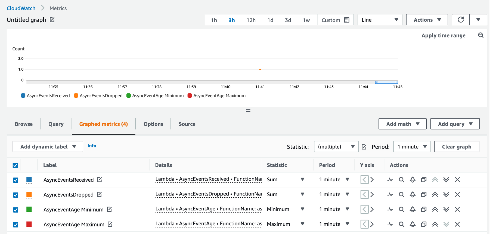

# Async invocation metrics for AWS Lambda

This is the sample code accompanying the launch blog for new asynchronous invocation metrics for AWS Lambda.

## Pre-requisites
1. [AWS CLI](https://docs.aws.amazon.com/cli/latest/userguide/getting-started-install.html)
2. [AWS SAM CLI](https://docs.aws.amazon.com/serverless-application-model/latest/developerguide/install-sam-cli.html)
3. [jq](https://stedolan.github.io/jq/)

## Setup
Deploy the SAM template to set up the test function. First, set the region you wish to deploy to.

```bash
export REGION=<your AWS region>
```

Use SAM CLI to deploy the template in this repo. Build the application:

```bash
sam build
```

Use the `--guided` option to deploy. Specific stack name as `lambda-async-metrics`. Accept default values for the rest.

```bash
sam deploy --guided --region $REGION
```

Save the name of the function in an environment variable.

```bash
FUNCTION_NAME=$(aws cloudformation describe-stacks \
  --region $REGION \
  --stack-name lambda-async-metric \
  --query 'Stacks[0].Outputs[?OutputKey==`HelloWorldFunctionResourceName`].OutputValue' --output text)
```

## Troubleshooting scenarios
This repo covers 4 troubleshooting scenarios. The analysis for the first two is covered in depth in the blog. We will include only the instructions to configure and test them here. There are dependencies between the scenarios and steps must be executed sequentially.

### Scenario 1: Troubleshooting delays due to function errors
Set up and test instructions below.

1. Edit the function code in `hello_world/async-metrics-hello-world.py` to raise an exception:

```python
def handler(event, context):
  print("Hello from AWS Lambda")
  raise Exception("Lambda function throwing exception")
```

2. Save the file. Build and deploy:

```bash
sam build && sam deploy
```

1. Finally, invoke the function asynchronously:

```bash
aws lambda invoke \
  --region $REGION \
  --function-name $FUNCTION_NAME \
  --invocation-type Event out_file.txt
```

### Scenario 2: Troubleshooting delays because of concurrency limits

1. Set the function's reserved concurrency to 1 and timeout to 100 seconds in `template.yaml`:

```yaml
Resources:
  HelloWorldFunction:
    Type: AWS::Serverless::Function
    Properties:
      CodeUri: hello_world/
      Handler: app.lambda_handler
      Runtime: python3.9
      Timeout: 100
      MemorySize: 128
      Architectures:
      - x86_64
      ReservedConcurrentExecutions: 1
```

2. Edit the function code in `async-metrics-hello-world.py` to introduce a 90 second sleep and remove the exception line from previous scenario:

```python
import time

def handler(event, context):
  time.sleep(90)
  print("Hello from AWS Lambda")
```

3. Save the file. Build and deploy:

```bash
sam build && sam deploy
```

1. Invoke the function twice in succession from the command line: 

```bash
for i in {1..2}; do aws lambda invoke \
  --region $REGION \
  --function-name $FUNCTION_NAME \
  --invocation-type Event out_file.txt; done
```

### Scenario 3: Troubleshooting dropped events because of expiration
Lambda discards the event once it expires. You can override the maximum retry duration of of 6 hours for throttling and system errors by configuring maximum event age for the function. You will use this to test event expiry without having to wait for 6 hours! Update the function configuration from scenario 2 to set the maximum age of event to 60 seconds. This is the lowest value that can be set for event age. This means Lambda will drop any event for this function that stays longer than 60 seconds in the internal queue

1. Update the function configuration to set the maximum age of event to 60 seconds. 

```yaml
Resources:
  HelloWorldFunction:
    Type: AWS::Serverless::Function
    Properties:
      CodeUri: hello_world/
      Handler: app.lambda_handler
      Runtime: python3.9
      Timeout: 100
      MemorySize: 128
      Architectures:
      - x86_64
      ReservedConcurrentExecutions: 1
      EventInvokeConfig:
        MaximumEventAgeInSeconds: 60
```

2. Build and deploy the function:

```bash
sam build && sam deploy
```

3. Invoke the function twice in succession from the command line. One of the events will be delivered to the function while the other will be throttled. Lambda will retry this request until the event has spent 60 seconds in the internal queue. It will then discard it.

```bash
for i in {1..2}; do aws lambda invoke \
  --region $REGION \
  --function-name $FUNCTION_NAME \
  --invocation-type Event out_file.txt; done
```

In a real world scenario, you would suspect a missing event if the processing did not occur as indicated by downstream actions of function execution.Begin by looking at AsyncEventsReceived to confirm events made it to Lambda. If this matches what you expect (2 in this case), the next step is to look at `AsyncEventsDropped` metric. You will have to wait for a minute to see data points for this.


Look at the `AsyncEventAge` metric to verify delays in processing.


Event age increases from 37 ms to a maximum of 30,086 ms (around half a minute). If the event has expired when Lambda polls the queue, it will drop it and not emit AsyncEventAge metric. This is why we only see the max event age of half a minute and not a value closer to the event age configuration of 1 minute. We can do a sanity check with Fig 6b that shows that after the retry when event age is half minute, next retry is around the minute mark. At this point, event is dropped in this scenario and metric is not published.

Check if the function was throttled next. The data is similar to scenario 2 where there were 6 throttles (5 retries) before event was dropped. The data points are distributed a little differently with 4 in the first 1 minute interval and 2 in the next.


Following the flowchart, the next step is to check reserved concurrency. One course of action is to increase the reserved concurrency if we expect number of concurrent invocations to go up.

### Scenario 4: Troubleshooting dropped events because of reserved concurrency set to zero

Lambda does not retry if reserved concurrency is 0. You will make one change to the configuration for scenario 3. Update reserved concurrent executions to 0. 

1. Set the function reserved concurrency to 0:

```yaml
Resources:
  HelloWorldFunction:
    Type: AWS::Serverless::Function
    Properties:
      CodeUri: hello_world/
      Handler: app.lambda_handler
      Runtime: python3.9
      Timeout: 100
      MemorySize: 128
      Architectures:
      - x86_64
      ReservedConcurrentExecutions: 0
      EventInvokeConfig:
        MaximumEventAgeInSeconds: 60
```

1. Invoke the function asynchronously:

```bash
aws lambda invoke \
  --region $REGION \
  --function-name $FUNCTION_NAME \
  --invocation-type Event out_file.txt
```

The trigger for troubleshooting is again a missing event. You will inspect AsyncEventsReceived and AsyncEventsDropped first.  They will both be 1. 


There will be no data points for `AsyncEventAge`. As explained in scenario 3, this metric is published only when Lambda attempts to deliver it to the function. In this case Lambda will see a reserved concurrency of 0 and drop it.



There will be no data points for `Throttles` either as event was not delivered to the function.


This concludes the troubleshooting scenarios.

## Cleanup
1. Delete the stack created by SAM template. Choose default option for the prompts.

```bash
sam delete lambda-async-metrics --region $REGION
```

## Security

See [CONTRIBUTING](CONTRIBUTING.md#security-issue-notifications) for more information.

## License

This library is licensed under the MIT-0 License. See the LICENSE file.

